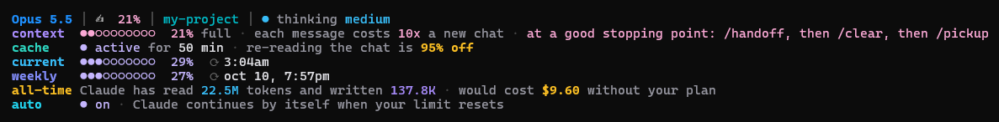

# Claude Code status bar

A status bar for Claude Code that shows how full your chat is, how close you are to your usage limits, and what to do about it. It also includes two small commands, `/handoff` and `/pickup`, that let you start a fresh chat without losing your place.

Built for Windows. It runs on the PowerShell that comes with Windows, so there is nothing extra to install. Windows Terminal is recommended so all the symbols show up.



*The screenshot uses sample data.*

## The problem

Claude Code sends the whole chat again with every message. A long chat costs more per message than a short one, so usage limits run out much faster than you would expect. The default screen does not tell you any of this:

- You can't see how big the chat has become, or how much each message costs compared to a fresh chat.
- Claude Code keeps a cache (a saved copy of the chat) that makes re-reading it much cheaper. It runs out after a while, and you are not told when.
- You can't see your 5-hour and weekly limits without running `/usage`.
- Starting a new chat to save usage means losing everything the old chat knew.
- When you hit a limit, work stops until you come back and type something.

## How this solves it

**A status bar with 7 rows.** Every row uses the same colors: lavender means fine, light pink means keep an eye on it, magenta means act soon, red means act now.

| Row | What it shows |
|---|---|
| top line | model, how full the chat is, project folder and git branch (`*` means uncommitted changes), thinking level |
| context | how full the chat is, how many times more each message costs than a new chat, and advice on when to start fresh |
| cache | whether the cheap re-reading is still active and how many minutes are left. If it has run out, it shows how much more the next message will cost |
| current | your 5-hour limit and when it resets |
| weekly | your weekly limit and when it resets |
| all-time | total tokens Claude has read and written, and what that would cost at normal API prices |
| auto | whether Claude carries on by itself when a limit resets |

**`/handoff` and `/pickup`.** When a chat gets long, `/handoff` writes a short note with the goal, what is done, files changed, and next steps. Then `/clear` empties the chat, and `/pickup` reads the note back so Claude carries on where it left off. The new chat is small and cheap again. Notes are kept in one folder, and finished ones move to an `archive` folder.

**Auto-continue.** Claude Code resumes on its own when your usage limit resets.

**Auto-compact at 300K tokens.** On models with a 1 million token window, Claude Code normally waits until about 967K tokens before it shrinks the chat. By then you have used a lot of your limit. This setting makes it happen at 300K.

## What is in this repo

| File | Purpose |
|---|---|
| `statusline/statusline.ps1` | the status bar script |
| `skills/handoff/SKILL.md` | the `/handoff` command |
| `skills/pickup/SKILL.md` | the `/pickup` command |
| `examples/settings.json` | settings to add to Claude Code |
| `examples/CLAUDE.md` | tells Claude what to keep when it shrinks a chat |

## Install (Windows)

You need Claude Code version 2.1.234 or newer for auto-continue. Check with `claude --version`.

In the steps below, `<CONFIG>` means your Claude folder. That is usually `C:\Users\<you>\.claude`. If you set the `CLAUDE_CONFIG_DIR` variable, use that folder instead.

1. **Copy the script.** Put `statusline/statusline.ps1` at `<CONFIG>\statusline\statusline.ps1`.

2. **Update settings.** Open `<CONFIG>\settings.json` and add the keys from `examples/settings.json`. Keep your other settings. Change the path to where you put the script, and use forward slashes (`/`) in it.

3. **Add the commands.** Copy `skills/handoff` and `skills/pickup` into `<CONFIG>\skills\`. In both `SKILL.md` files, replace `<HANDOFFS>` with the folder where notes should go, for example `C:\Users\<you>\.claude\handoffs`.

4. **Add the compact instructions.** Copy the text from `examples/CLAUDE.md` to the end of `<CONFIG>\CLAUDE.md`. Create the file if it does not exist.

5. **Restart Claude Code.** The status bar appears after your first message.

You can also open Claude Code, point it at this repo, and ask it to set things up using this README.

### Test the script

Run this in PowerShell. You should see all 7 rows with no errors.

```powershell
$now = [DateTimeOffset]::UtcNow.ToUnixTimeSeconds()
'{"model":{"id":"claude-opus-5-5","display_name":"Opus 5.5"},"workspace":{"current_dir":"C:\\my-project"},"context_window":{"used_percentage":21,"current_usage":{"input_tokens":2,"cache_creation_input_tokens":500,"cache_read_input_tokens":205000}},"prompt_cache":{"warm":true,"caching_observed":true,"ttl":"1h","expires_at":' + ($now+3000) + '},"thinking":{"enabled":true},"effort":{"level":"medium"},"rate_limits":{"five_hour":{"used_percentage":29,"resets_at":' + ($now+7200) + '},"seven_day":{"used_percentage":27,"resets_at":' + ($now+500000) + '}}}' |
  powershell -NoProfile -ExecutionPolicy Bypass -File "$HOME\.claude\statusline\statusline.ps1"
```

The first run reads all your old chats to count all-time totals, so it may take a few seconds. After that it only reads what is new.

### If you see boxes instead of symbols

The old black console window cannot show some of the symbols (`⟳`). Use Windows Terminal instead: `winget install --id Microsoft.WindowsTerminal --exact`. On Windows editions without the Store, download the portable zip from the [Windows Terminal releases page](https://github.com/microsoft/terminal/releases/latest).

### macOS and Linux

The script runs with PowerShell 7 (`pwsh`). Use `pwsh -NoProfile -File ~/.claude/statusline/statusline.ps1` as the command. On macOS the 5-hour fallback described below does not work, because the login is stored in the Keychain. The other rows still work.

The `/handoff` and `/pickup` commands mention PowerShell commands such as `Get-Date` and `Move-Item`. Claude will usually use the matching command for your system, but you can edit the two `SKILL.md` files to use `date` and `mv` instead.

## How to use it

| When | Do this |
|---|---|
| Switching to a different task | `/clear`. You can get the old chat back with `/resume` |
| The context row turns light pink and you are at a good stopping point | `/handoff`, then `/clear`, then `/pickup <topic>` |
| You forgot which notes exist | `/pickup` with nothing after it lists them |
| The work in a note is finished | `/pickup done` moves it to the archive |
| In the middle of a task and can't stop | `/compact keep file paths, decisions, next steps` |

Hand off while the cache row still says **active**. Once it has run out, the next message reads the whole chat at full price, which can cost about 40 times more on Opus 5.5.

## Notes

- **All-time totals** are counted from the chat history Claude Code keeps in `<CONFIG>\projects`. Claude Code deletes old chats after about 30 days, so the count starts from the oldest chat still there. From then on the script keeps its own totals, so the number keeps growing. Delete `usage-cache.json` and `seen-ids.txt` in `<CONFIG>\statusline` to count again from scratch.
- **"would cost $X"** uses normal API prices for each model. It is not what your subscription charges. The prices are listed near the top of the script. If a model's price changes, or a new model comes out, update the `$PRICES` list.
- **5-hour limit fallback.** Sometimes Claude Code does not send the 5-hour limit to the status bar. The script then asks `api.anthropic.com/api/oauth/usage` (the same source `/usage` uses), with the login token from `<CONFIG>\.credentials.json`. It asks at most once every 2 minutes. The token is only sent to api.anthropic.com and the script does not save it. This address is not documented and may change. To turn it off, delete the `Get-ApiLimits` part of the script.
- **Check your PC clock.** If the clock or time zone is wrong, limits look like they have reset and the reset times are wrong.
- **Speed.** Each update takes about 1 second, mostly PowerShell starting up.
- **Why the script has no special characters in it.** Windows PowerShell 5.1 misreads them, so every symbol is built from its character code.

## Remove it

Delete the `statusLine` entry from `settings.json` and the `<CONFIG>\statusline` folder. To turn auto-continue off, set `autoContinueAtUsageLimit` to `false` or change it in `/config`.

## License

MIT. See [LICENSE](LICENSE).
